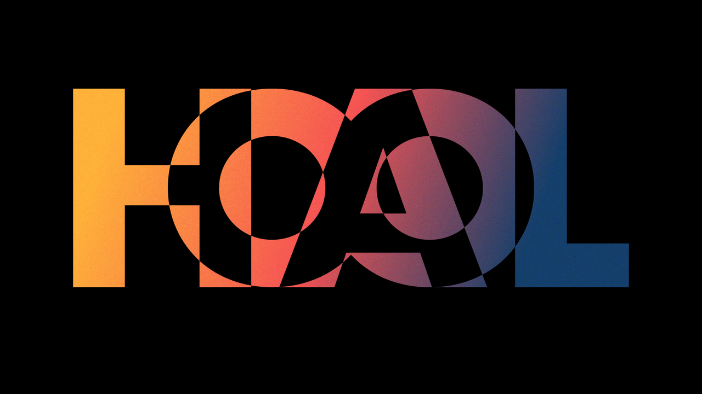

# HAL 8 AI Web UI

🌐 **Website: [satoshigreek.github.io/HAL-8-AI-WEB-UI](https://satoshigreek.github.io/HAL-8-AI-WEB-UI/)**
🚀 **App: [hal8.odyssey-works.io](https://hal8.odyssey-works.io)**



**The HAL 8 web interface** — a self-hosted AI chat platform carrying the HAL 8 design language, built on [Open WebUI](https://github.com/open-webui/open-webui) v0.10.2. It supports Ollama and any OpenAI-compatible API, with built-in RAG, RBAC, plugins, channels and more.

HAL 8 is the metered AI inference and agent platform by HAL 8 Ltd — see [the HAL 8 site](https://github.com/satoshigreek/hal8-ltd).

## What changed from upstream

This repository is a clean snapshot of Open WebUI `v0.10.2` with a HAL 8 reskin:

- **Branding assets** — favicons, logo, splash screen, PWA manifest icons and banner use the HAL 8 gradient "8" mark.
- **Application name** — the app identifies as **HAL 8** (backend `WEBUI_NAME` default, frontend `APP_NAME`, page titles, notifications, PWA manifest).
- **Dark theme** — the neutral gray scale is remapped to HAL 8's green-tinted near-black palette (base `#07100c`).
- **Typography** — Space Grotesk as the primary UI face, JetBrains Mono for code and mono contexts.

Everything else — features, configuration, deployment — works exactly like upstream Open WebUI. The [Open WebUI documentation](https://docs.openwebui.com/) applies.

## Quick start

> Taking it live on a public domain with HTTPS? See **[DEPLOYMENT.md](./DEPLOYMENT.md)**.

### Docker

```bash
docker build -t hal8-web-ui .
docker run -d -p 3000:8080 -v hal8-data:/app/backend/data --name hal8-web-ui hal8-web-ui
```

Then open http://localhost:3000.

### From source

```bash
# Frontend
npm install
npm run build

# Backend
cd backend
pip install -r requirements.txt
bash start.sh
```

## License and attribution

This project is a derivative of [Open WebUI](https://github.com/open-webui/open-webui), Copyright (c) 2023- Open WebUI Inc., and is distributed under the upstream [Open WebUI License](./LICENSE) (BSD-3-based with a branding clause; see `LICENSE`, `LICENSE_HISTORY` and `LICENSE_NOTICE`).

Note: the Open WebUI license permits replacing the "Open WebUI" branding only for deployments with 50 or fewer users in any rolling thirty-day period, or with written permission or an enterprise license from the copyright holder. This rebranded interface is intended for deployments that satisfy one of those conditions.

© 2026 HAL 8 Ltd · ADGM License No. 17920 · Al Maryah Island · Abu Dhabi · UAE
